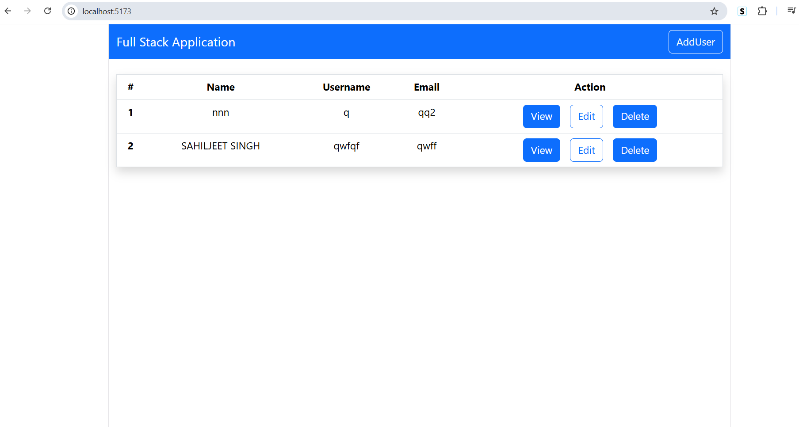
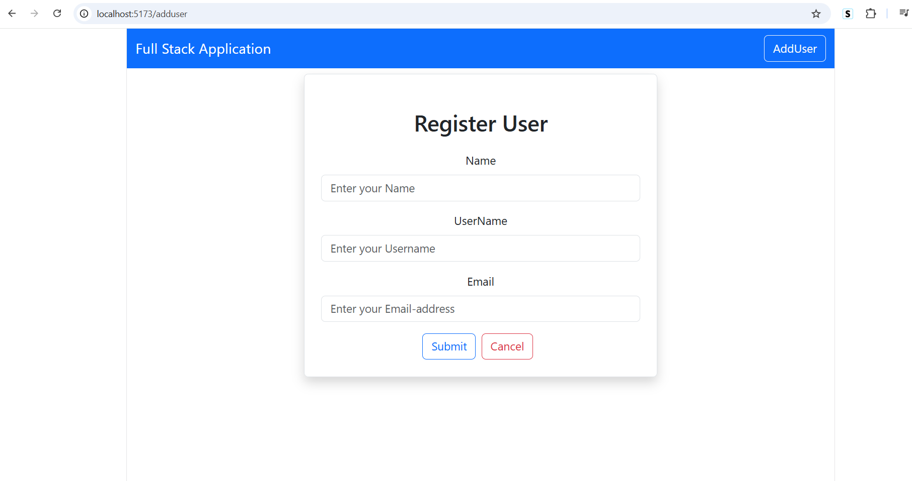

# User Management System

A full-stack CRUD (Create, Read, Update, Delete) application built using **Spring Boot**, **React**, and **MySQL**. The project demonstrates REST API development on the backend and a responsive React frontend for managing user records.

# Tech Stack

# Backend
- Java 17
- Spring Boot
- Spring Data JPA
- Hibernate
- MySQL
- Maven

# Frontend
- React
- React Router DOM
- Axios
- Bootstrap
- Vite

---------------------------------------------------

# Features

- Add a new user
- View all users
- View user details
- Update existing users
- Delete users
- REST API integration using Axios
- Responsive UI with Bootstrap

----------------------------------------------------

## Project Structure

```
UserManagementSystem
│
├── frontend/
├── simplebackend/
├── README.md
└── screenshots/
```

---

# Getting Started

# Clone the repository

```bash
git clone https://github.com/Sahiljeet1021/UserManagementSystem.git
cd UserManagementSystem
```

# Backend Setup

```bash
cd simplebackend
mvn spring-boot:run
```

The backend runs on:

```
http://localhost:8080
```

# Frontend Setup

```bash
cd frontend
npm install
npm run dev
```

The frontend runs on:

```
http://localhost:5173
```

---

# Database Configuration

Create a MySQL database and update the credentials in:

```
simplebackend/src/main/resources/application.properties
```

Example:

```properties
spring.datasource.url=jdbc:mysql://localhost:3306/userOp
spring.datasource.username=root
spring.datasource.password=your_password
```

---

# API Endpoints

| Method | Endpoint | Description |
|---------|----------|-------------|
| GET | `/users` | Get all users |
| GET | `/user/{id}` | Get user by id |
| POST | `/user` | Add user |
| PUT | `/user/{id}` | Update user |
| DELETE | `/user/{id}` | Delete user |

---

# Screenshots

# Home Page



# Add User



---

# Future Improvements

- Authentication using Spring Security & JWT
- Input validation
- Search functionality
- Pagination & Sorting
- Docker deployment

---

# Author

**Sahiljeet Singh**

GitHub: https://github.com/Sahiljeet1021
